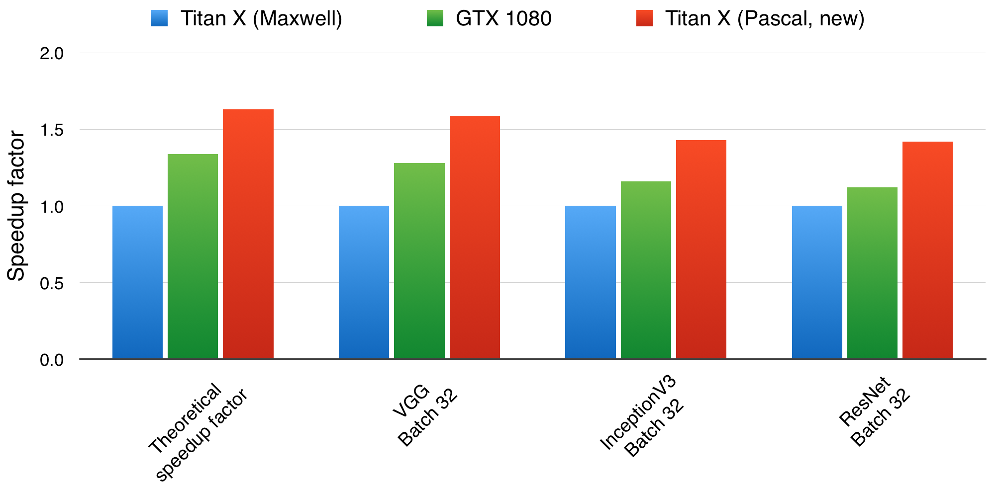

#MXNet 帕斯卡架构 Titan X 速度评测

## 简介

感谢NVIDIA赠送给MXNet一块2016新版Pascal架构Titan X。我们用MXNet <http://mxnet.dmlc.ml>上常见的深度学习模型对这块显卡做了模型计算能力的性能基准测试，所有的测试内容遵循deepmark的测试规范（规范详情请参见 <https://github.com/DeepMark/deepmark> ）。

简单来说，新版Pascal架构的Titan X比其它主流显卡有如下速度提升：

1. Pascal Titan X vs GTX 1080: 新的帕斯卡版 Titan X 约是 GTX 1080 速度的1.3倍左右，Titan X的12GB显存也可以支持在MXNet上用更大的batch size （比如batch size 64）训练执行VGG ResNet等模型.
2. Pascal Titan X vs Maxwell Titan X: 新版Titan X的速度约为Maxwell版 Titan X的1.4到1.6倍.

## 评测环境

评测标准遵循deepmark标准，使用Inception-V3 VGG-D 和 ResNet标准全尺寸模型。软件配置环境为：

nvidia-367.35, cuda 8.0, gcc 4.8.4, ubuntu 14.04, cudnn 5.0.5

## 评测结果

### 评测结果：每轮forward+backward+update运行时间（毫秒ms）

|Card|VGG Batch 32|VGG Batch 64|InceptionV3 Batch 32|InceptionV3 Batch 64| ResNet Batch 32| ResNet Batch 64|
|---|---|---|---|---|---|---|
|Titan X (Maxwell)|499|971|372|730|307|603|
|GTX 1080|390|显存不足*|320|显存不足*|275|显存不足*|
|GTX 1080 with MXNet Mirror|410|801|360|707|315|630|
|Titan X (Pascal)|314|610|260|502|216|420|

注意：我们的评测方法遵循deepmark（参见<https://github.com/DeepMark/deepmark>）对深度学习模型评测标准，在标准全尺寸模型上计算每一轮 forward+backward+update  的总时间，而caffe2的评测结果使用的是简化版小尺寸VGG和Inception模型在forward only和forward+backward上的运行时间 （参见 <https://github.com/caffe2/caffe2/blob/master/caffe2/python/convnet_benchmarks.py>）。这两组评测结果不能直接对比。

*因为GTX 1080只有8GB显存，默认设置下不能运行batch size 64。MXNet可以使用Mirror的方法节省内存。使用Mirror会对计算性能造成一些损失，我们把它当作单独一步测试，添加到表中补全Batch 64的测试结果。

### 性能对比：Maxwell Titan X vs GTX 1080 vs Pascal Titan X

|Card|theoretical speedup factor|VGG Batch 32|VGG Batch 64|InceptionV3 Batch 32|InceptionV3 Batch 64| ResNet Batch 32| ResNet Batch 64|
|---|---|---|---|---|---|---|---|
|Titan X (Maxwell)|1|1|1|1|1|1|1|
|GTX 1080|1.34|1.28|N/A|1.16|N/A|1.12|N/A|
|Titan X (Pascal)|1.63|1.59|1.59|1.43|1.46|1.42|1.44|

这组性能对比以Maxwell版Titan X为基准运行速度，数值越大代表运行速度越快。

#Reference

[1] ResNet: Kaiming He, Xiangyu Zhang, Shaoqing Ren, and Jian Sun. "Deep Residual Learning for Image Recognition." CVPR 2016.

[2] ResNet: Kaiming He, Xiangyu Zhang, Shaoqing Ren, and Jian Sun. "Identity Mappings in Deep Residual Networks." ECCV 2016.

[3] Inception: Christian Szegedy, Vincent Vanhoucke, Sergey Ioffe, Jonathon Shlens, Zbigniew Wojna, “Rethinking the Inception Architecture for Computer Vision” https://arxiv.org/abs/1512.00567
[4] VGG: Karen Simonyan and Andrew Zisserman. "Very Deep Convolutional Networks for Large-Scale Image Recognition." ICLR 2015

[5] Russakovsky, Olga, et al. "Imagenet large scale visual recognition challenge." International Journal of Computer Vision (2014): 1-42.

[6] Deepmark protocol <https://github.com/DeepMark/deepmark>

[7] Caffe2 benchmark table and source code
<https://docs.google.com/spreadsheets/d/1nPup-R9muaPvw_ap4MQnH3xgQIT78xy-GLxrQmknbtM/htmlview#gid=0> , <https://github.com/caffe2/caffe2/blob/master/caffe2/python/convnet_benchmarks.py>

[8] Some other benchmark example
https://github.com/jcjohnson/cnn-benchmarks